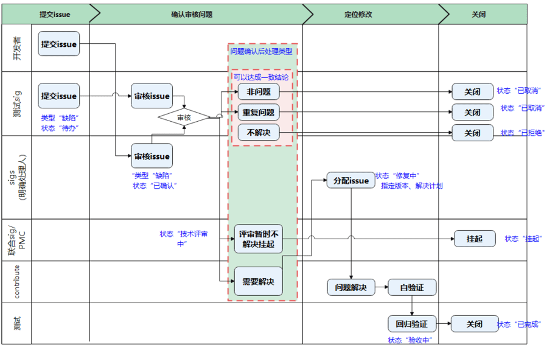

# 缺陷类Issue处理指导

## 缺陷来源

社区开发者提交的需求和测试sig在测试过程发现的缺陷提交的issue。
流程如下图：

## 缺陷的创建
[规则 1]：所有缺陷创建按照模板提交
**【模块名_概率】简要描述：**

 **【环境信息】:** 
- 网络环境
- 硬件开发板型号
- 软件版本信息或tag节点
- 测试环境
- 其他

 **【预置条件】:**

 **【测试步骤】：**

 **【预期结果】：**

 **【实际结果】：**

 **【恢复手段】：**

 **【出现概率】：问题出现次数/实际测试次数**

 **【定位信息】：**

- 1. Log、截图、多媒体文件等，所有和问题有关的信息：

## 缺陷审核
- [规则 1]：缺陷审核责任人：测试提交缺陷由测试sig组织确认和审核，社区开发者提交缺陷由sig组组织确认和审核 
- [规则 2]：issue各字段需要确保正确，正确的issue字段是度量的基础，在审核环节需要刷新issue的状态，issue的优先级、指定issue责任人 
- [规则 3]：如果经过审核和提交人达成一致，明确是非问题的，可以直接关闭，状态为“已取消” 
- [规则 4]：如果经过审核和提交人达成一致，明确是已知重复问题的，可以把已知issue号关联起来，可以直接关闭，状态为“已取消” 
- [规则 5]：如果经过审核和提交人达成一致，明确是问题，但是版本不解决，当前可以直接关闭，状态为“挂起” 
- [规则 6]：如果经过审核和提交人无法达成一致，此类缺陷提交到联合sig组，组织技术评审，按照评审结论执行，或解决或挂起 

## 缺陷的修改
- [规则 1]：缺陷修改描述清楚问题发生原因和定位过程。 
- [规则 2]：先定位后修改，原因分析需填写原因分析和修改方案，如有设计文档，按需附上设计文档，指导后续的测试设计和验证。 
- [规则 3]：测试用例设计，白盒自动化用例要做到代码逻辑全覆盖，手工测试用例要做到修改场景上的覆盖。建议：如果修改代码量在50行以下，设计测试用例不少于5条；50行及以上，测试用例在代码行的10%以上； 
- [规则 4]：如果问题单涉及多人、多sig组同步修改或上下层同时修改，建议新建issue，把相关issue关联起来 
- [规则 5]：如果转给其他责任人修改，需要和对应sig组对齐达成一致后转移责任人，如果issue所属代码仓错误，和对应仓责任人沟通确认后编辑修改到正确代码仓。代码仓和责任人是issue度量的基础，度量看板严格按照代码仓和责任人卷积到对应组织。 
- [规则 6]：首问责任制：issue的处理按照首问责任制执行，issue提交到哪个代码仓下，首问哪个代码仓对应的sig组负责组织定位 
- [规则 7]：缺陷的状态是缺陷管理的基础，需要责任人及时更新缺陷的状态字段，OpenHarmony社区定义的状态有如下： 

|  序号 |状态   |处理责任人   |说明   |
| ------------ | ------------ | ------------ | ------------ |
|1   | 待办的  | 提交者  |   |
| 2  | 已确认  | sig组  | 按照测试sig提交缺陷有测试组织确认，开发者提交缺陷由sig组组织确认  |
| 3  | 技术评审中  | 联合sig  | 对缺陷方案有争议，要到联合sig/PMC上决策  |
| 4  | 修复中  | sig组  | sig组负责修复并提交pr  |
| 5  | 验收中  | 测试或issue提交者  | pr提交后走到测试验收或对应提交者验收  |
| 6  | 已完成  | 测试或issue提交者  | 经过验收后状态走到已完成状态，表示issue处理闭环  |
| 7  | 已取消  | 测试或issue提交者  | 经过确认和提交者达成一致意见后可以取消  |
| 8  | 已拒绝  | sig组  | 经过确认和提交者达成一致意见后，可以决绝  |
| 9  | 已挂起  | sig组  | 经过确认和提交者无法达成一致意见经过联合sig/PMC评审决策后问题可以挂起，暂不解决，明确后面版本解决计划  |

